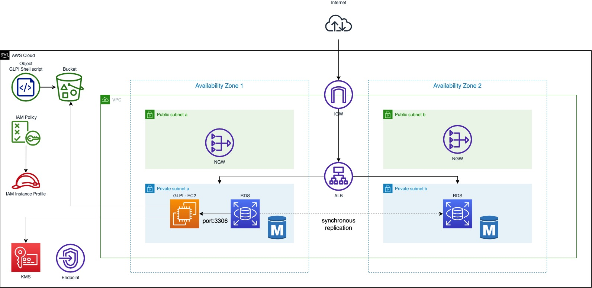

# GLPI on RDS High Availability - Terraform

<p align="center">
	<a href="https://join.slack.com/t/yrisgroupe/shared_invite/zt-1q51z8dmv-GC0XzUSclzBnUQ0tpKhznw"></a>
	<a href="https://github.com/Yris-ops/glpi-on-rds-high-availability-for-aws-terraform"></a>
	<a href="https://github.com/Yris-ops/glpi-on-rds-high-availability-for-aws-terraform"></a>
	<a href="https://twitter.com/cz_antoine"></a>
	<a href="https://www.linkedin.com/in/antoine-cichowicz-837575b1"></a>
<p>



The purpose of this Terraform template creates a high availability setup for GLPI using an EC2 instance, an RDS MariaDB instance and a shell script installing GLPI on a Linux server.

This README file provides a comprehensive guide on how to install and configure GLPI on an Ubuntu-based 20.04 system. I hope it helps you get started with using GLPI for your IT asset management needs.

## Key Components

- aws_key_pair: This resource creates an SSH key pair that will be used to connect to the EC2 instance where GLPI will be installed.
- aws_iam_instance_profile: This resource creates an IAM instance profile, which will be attached to the EC2 instance to provide it with the necessary permissions to access other AWS services like SSM.
- aws_iam_role: This resource creates an IAM role for the EC2 instance. It allows the EC2 instance to assume this role and access the authorized AWS services.
- aws_iam_role_policy: This resource attaches an IAM policy to the EC2 role. The ec2ssmcwlogsaccess_iam_policy and ec2ssmaccess_iam_policy policies grant the EC2 instance the required access to SSM and CloudWatch Logs services for management and monitoring.
- aws_db_subnet_group: This resource creates a subnet group for RDS. It specifies the private subnets where RDS will be deployed.
- aws_s3_bucket: This resource creates an S3 bucket that will be used to store a GLPI installation script.
- aws_s3_bucket_object: This resource creates an object in the previously created S3 bucket. The object contains a bash script that installs and configures GLPI on the EC2 instance.
- aws_instance: This resource deploys the EC2 instance where GLPI will be installed. It is configured with the SSH key, IAM instance profile, custom startup script, and other necessary parameters.
- aws_db_instance: This resource deploys an RDS instance to host the GLPI database. It uses the previously created subnet group and other specified configuration settings.
- aws_lb: This resource deploys an Application Load Balancer (ALB) for high availability and traffic distribution to the EC2 instance.
- aws_lb_target_group: This resource creates a target group for the ALB, specifying the EC2 instance as the target for traffic.
- aws_lb_listener: This resource configures a listener on the ALB to redirect incoming traffic to the target group.

## Requirements

| Name | Version |
|------|---------|
| <a name="requirement_aws"></a> [aws](#requirement\_aws) | >= 3.0.0 |

## Providers

| Name | Version |
|------|---------|
| <a name="provider_aws"></a> [aws](#provider\_aws) | 5.7.0 |
| <a name="provider_local"></a> [local](#provider\_local) | 2.4.0 |
| <a name="provider_tls"></a> [tls](#provider\_tls) | 4.0.4 |

## Parameters

The following parameters must be passed to the `variable.tf` file:

| Name | Description | Type | Default | Required |
|------|-------------|------|---------|:--------:|
| <a name="input_AMI"></a> [AMI](#input\_AMI) | Amazon Machine Image (AMI) ID | `string` | n/a | yes |
| <a name="input_EC2InstanceProfile"></a> [EC2InstanceProfile](#input\_EC2InstanceProfile) | Instance profile for Systems Manager | `string` | n/a | yes |
| <a name="input_EC2InstanceType"></a> [EC2InstanceType](#input\_EC2InstanceType) | EC2 instance type | `string` | n/a | yes |
| <a name="input_InternetGateway"></a> [InternetGateway](#input\_InternetGateway) | Internet Gateway | `string` | n/a | yes |
| <a name="input_PrivateSubnetA"></a> [PrivateSubnetA](#input\_PrivateSubnetA) | Private Subnet A | `string` | n/a | yes |
| <a name="input_PrivateSubnetB"></a> [PrivateSubnetB](#input\_PrivateSubnetB) | Private Subnet B | `string` | n/a | yes |
| <a name="input_PublicSubnetA"></a> [PublicSubnetA](#input\_PublicSubnetA) | Public Subnet A | `string` | n/a | yes |
| <a name="input_PublicSubnetB"></a> [PublicSubnetB](#input\_PublicSubnetB) | Public Subnet B | `string` | n/a | yes |
| <a name="input_VPC"></a> [VPC](#input\_VPC) | VPC Id | `string` | n/a | yes |
| <a name="input_bucket_name"></a> [bucket\_name](#input\_bucket\_name) | Bucket Name | `string` | n/a | yes |
| <a name="input_encrypted_password"></a> [encrypted\_password](#input\_encrypted\_password) | Encrypted GLPI password | `string` | MySuperGlpi2022 | yes |
| <a name="input_key_pair_name"></a> [key\_pair\_name](#input\_key\_pair\_name) | Key Pair name | `string` | n/a | yes |
| <a name="input_multi_az"></a> [multi\_az](#input\_multi\_az) | Multi AZ | `bool` | true | yes |
| <a name="input_policy_name"></a> [policy\_name](#input\_policy\_name) | Policy Name | `string` | n/a | yes |
| <a name="input_region"></a> [region](#input\_region) | AWS region | `string` | n/a | yes |

## Usage

Edit the `variables.tf` with your own AWS configuration and `userdata.sh` file with your bucket name.

To use Terraform with AWS, you can follow these steps:

``` bash
terraform init && terraform apply --auto-approve
```

After running terraform apply, waits for the instance to be deployed, this takes a little time.

## Access GLPI

You should now be able to access to the GLPI web application by accessing your ALB's IP address in your web browser `/glpi/index.php`. The GLPI setup wizard should appear, allowing you to complete the setup process and enjoy.

[Install wizard](https://glpi-install.readthedocs.io/en/latest/install/wizard.html)

## CloudFormation version

[GLPI on RDS High Availability - CloudFormation](https://github.com/Yris-ops/glpi-on-rds-high-availability-for-aws)

## Security

See [CONTRIBUTING](CONTRIBUTING.md#security-issue-notifications) for more information.

## License

This repository is licensed under the Apache License 2.0. See the LICENSE file.
